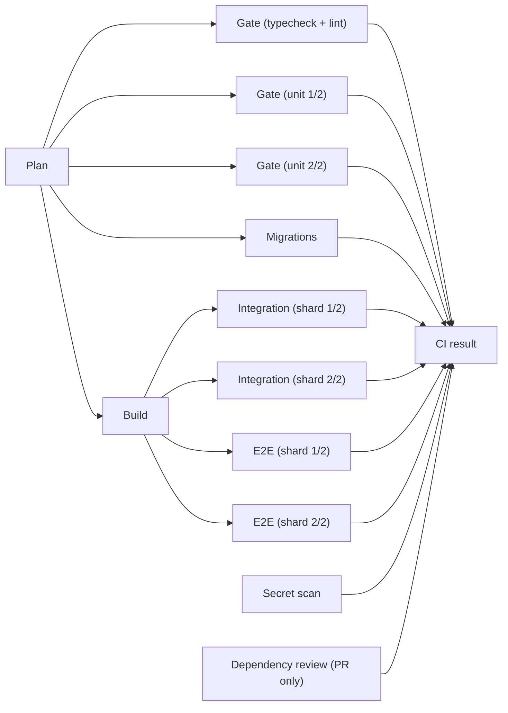

# CI and deployment

How changes are checked before they reach production: which workflows run,
on which runner, what is required to merge, and how to debug a red run.

- Workflows: `.github/workflows/ci.yml`, `nightly.yml`, `codeql.yml`,
  `claude-review.yml`; Dependabot: `.github/dependabot.yml`.
- Shared install step: `.github/actions/setup` (pnpm from `packageManager`,
  Node from `.nvmrc`, `pnpm install --frozen-lockfile`).
- CI scripts: `scripts/ci/` (throwaway Postgres, migration policy, PG client,
  runner-hook reference copies), `scripts/db-migrate.mjs`,
  `scripts/vercel-ignore-build.mjs`.

## 1. What runs when

| Situation | CI graph (`ci.yml`) | Lane | CodeQL | Claude review | Vercel |
|---|---|---|---|---|---|
| Local, before push | `pnpm verify` via the opt-in pre-push hook | your machine | – | – | – |
| Same-repo PR | every job | hosted; Mac when enabled | yes | once on open / ready / reopen; label or comment on demand | preview build |
| Same-repo PR, docs-only | Plan, Secret scan, Dependency review, `CI result`; code jobs skipped | hosted | yes | as above | preview skipped |
| Draft PR | every job | as same-repo | yes | never (label ignored) | preview build |
| Fork PR | every job, **after a maintainer approves the run** | always hosted | yes | never (no secrets; comment path re-checks) | preview build |
| Dependabot PR | every job | always hosted | yes | never | preview skipped |
| Push to `main` | every job, never cancelled | hosted; Mac when enabled | yes | – | production build |
| Nightly 04:17 UTC | `ci.yml` with `full: true` (full-history gitleaks) + `pnpm audit` | hosted; Mac when enabled | weekly, Mon 05:41 UTC | – | – |

"Docs-only" means every changed file is under `docs/` or ends in `.md`,
except any `AGENTS.md`; anything under `.github/`, `scripts/` or `supabase/`
always counts as code. `ci.yml`'s `plan` job and
`scripts/vercel-ignore-build.mjs` use the same rule.

CI needs no real secrets: `ci.yml` sets placeholder `NEXTAUTH_SECRET`,
`TOKEN_ENCRYPTION_KEY` and `CRON_SECRET`, so fork and Dependabot PRs run the
whole graph. The only workflow that uses a secret is `claude-review.yml`.

## 2. The job graph



Measured on hosted `ubuntu-24.04` (run
[36105562256](https://github.com/lapeninns/naba-presence/actions/runs/36105562256)):

| Job | Timeout | Measured | What it does |
|---|---|---|---|
| Plan | 5 | 3s | Picks the lane and whether code changed |
| Gate (typecheck + lint) | 10 | 1m10 | `pnpm typecheck`, `pnpm lint` |
| Gate (unit 1/2, 2/2) | 10 | 1m38 / 1m56 | `pnpm test --shard=N/2` |
| Migrations | 10 | 33s | See [Migrations](#6-migrations) |
| Build | 15 | 1m36 | `pnpm build`, packs `.next/standalone` as an artifact |
| Integration (shard 1/2, 2/2) | 20 | 3m41 / 4m50 | Own Postgres, migrate, runtime role, `pnpm test:integration --shard` |
| E2E (shard 1/2, 2/2) | 20 | 4m13 / 5m00 | Own Postgres, Playwright Chromium, `pnpm test:e2e --shard` |
| Secret scan | 5 | 5s | Pinned gitleaks CLI, SHA256-verified |
| Dependency review | 5 | 4s | `fail-on-severity: high`, PRs only |
| CI result | 5 | 2s | Aggregates everything above |

The critical path is Plan → Build → E2E (shard 2/2), about **6m50s**
end to end. The old single serial job took 18–21.5 minutes. CodeQL runs
separately in about 1m40.

Gate is split three ways because on a 4-vCPU hosted runner, typecheck, lint
and tests in one job took over 3 minutes. Integration is sharded because one
job took about 7.5 minutes and sat on the critical path.

`next build` needs no database (checked by building with no `DATABASE_URL`),
so Build starts straight after Plan. Integration and E2E both need the
standalone server that Build produced, and each shard runs against its own
cluster, so shards never share advisory locks or roles.

## 3. Required checks

**`CI result` is the only check to require.** It runs with `if: always()`,
reads `needs.*.result`, and fails if any job is `failure` or `cancelled`. A
`skipped` job counts as a pass: that is how a docs-only PR stays green while
its code jobs skip, and how Dependency review skips on pushes.

To add, split or shard a job, add it to `result`'s `needs` list. No ruleset
change is needed, because the ruleset only knows `CI result`. Job `name:`s
use the same string on both lanes, so moving between hosted and the Mac
never renames a check either.

CodeQL and Claude review are not required checks.

The ruleset on `main` (deletion and non-fast-forward blocked, PR required
with 0 approvals, `CI result` required with branches up to date, admin bypass
only through a PR) is applied after this lands, as `lapeninns`. Merges are
squash merges from an up-to-date branch, so the tree on `main` is the tree
CI tested. The full graph still runs on the push to `main`: it is free on a
public repo, gives release-checklist run URLs, and writes the caches, which
PRs can only read from `main`.

## 4. Caching and artifacts

| What | Key | Lifetime |
|---|---|---|
| pnpm store (hosted only) | `actions/setup-node` `cache: pnpm`, keyed on `pnpm-lock.yaml` | GitHub cache (7 days unused) |
| `.next/cache` (Build) | `next-<os>-<arch>-<lockfile hash>-<app/components/lib/next.config.ts hash>`, restores by lockfile prefix | GitHub cache |
| Playwright Chromium (E2E) | `ms-playwright-<os>-<arch>-<playwright version>` | GitHub cache; on a hit Linux runs `playwright install-deps chromium` only |
| `standalone-<os>-<arch>` artifact | `tar -czf` of `.next/standalone` (tar keeps pnpm's symlinks) | 1 day |
| `e2e-traces-shard-N` artifact | `test-results/`, uploaded **only when that shard fails** | 7 days |

The standalone build holds platform-native binaries (`sharp`/`@img`), so the
artifact name carries OS and arch, and Build → Integration → E2E always run
on the same lane. The Mac keeps its pnpm store and browsers on disk instead of
the Actions cache.

## 5. Local workflow

```bash
pnpm verify        # typecheck + lint + unit tests; no database. Before every push.
pnpm verify:full   # verify + build + integration; needs the local Supabase stack.
pnpm test:e2e      # browser journeys; pnpm test:a11y for accessibility only.
```

Run `verify` before pushing. Run `verify:full`, `test:e2e` and `test:a11y`
as well when you touch server code, the database or UI flows. CI runs
everything, plus migrations, secret scanning, dependency review and CodeQL.

**Pre-push hook (opt-in):** `pnpm hooks:install` sets
`core.hooksPath=.githooks`. `.githooks/pre-push` then runs `pnpm verify` and,
if `gitleaks` is installed, scans the commits you are pushing (`@{u}..HEAD`,
or `origin/main..HEAD` for a new branch). There is deliberately no `prepare`
script, so CI and Vercel installs never install hooks.

- `core.hooksPath` lives in the clone's shared `.git/config`, so it applies to
  every worktree of that clone. A worktree whose branch has no `.githooks/`
  runs no hook.
- Skip once with `SKIP_VERIFY=1 git push` or `git push --no-verify`. Undo with
  `git config --unset core.hooksPath`.

`tsconfig.json` excludes `.claude`, `.design-sync`, `.ds-sync`, `ds-bundle`
and `.worktrees`, matching ESLint's ignores. TypeScript already skips
dot-directories under `**` wildcards, but the gitignored `ds-bundle/` output
(60 generated files) was being typechecked wherever it existed.

## 6. Migrations

### Rules

- `supabase/migrations` is **append-only**. A migration that exists on `main`
  is never edited, renamed or deleted. Fix forward with a new file.
- New files are named `NNNN_snake_case.sql` and their 4-digit number must be
  higher than `main`'s highest. Numbers are compared as numbers, not strings.
  Allowlisted exceptions, in `scripts/migration-rules.mjs`: the `0021` gap,
  and the legacy `20260729000400_remove_local_demo_data.sql`.
- Each file records itself in `schema_migration`. The runner fails and rolls
  back a file that does not.
- **Expand, then contract.** Production migrations are run by hand and are not
  tied to a deploy (see below), so the deployed code and the schema are
  briefly out of step. Every migration must work with the code that is live
  when it runs, and the new code must work before it runs:
  - Expand (safe in one PR): add tables, nullable columns or columns with
    defaults, new indexes, new functions, and widen constraints.
  - Contract (a later PR, once no deployed code uses the object): drop or
    rename columns and tables, add `NOT NULL` without a default, and tighten
    constraints or RLS.
  - Reviewers hold PRs to this rule. A PR that needs both halves is split.

### How the runner behaves (`pnpm db:migrate`)

- Takes a session advisory lock on one connection, so concurrent runs queue.
  The two-int key `("naba", 1)` cannot collide with the app's own
  `hashtext()` locks. Waits up to `DB_MIGRATE_LOCK_TIMEOUT` seconds
  (default 600).
- Refuses a port-6543 (transaction pooler) URL, where a session lock would
  protect nothing. Use the direct URL or the session pooler (5432).
- Runs each file in its own transaction. Every file carries its own
  `begin;`/`commit;`, which the runner strips so its transaction owns the
  file. A file whose first line is `-- migrate:no-transaction` runs as-is;
  none currently do.
- Environment variables:

| Variable | Default | Purpose |
|---|---|---|
| `DIRECT_DATABASE_URL` (falls back to `DATABASE_URL`) | – | Admin connection |
| `MIGRATIONS_DIR` | `supabase/migrations` | Apply another tree, for example the merge base's |
| `DB_MIGRATE_EXPECT_NOOP=1` | off | Exit non-zero if any file would be applied |
| `DB_MIGRATE_LOCK_TIMEOUT` | `600` | Seconds to wait for the lock |

### What CI checks (the Migrations job)

1. **Policy:** `node scripts/ci/migration-policy.mjs origin/main` checks the
   rules above against the merge base, and writes `MIGRATION_BASE_SHA` to
   `$GITHUB_ENV` for step 3.
2. **From scratch:** `db:migrate`, then again with `DB_MIGRATE_EXPECT_NOOP=1`,
   `db:runtime-role` twice, then `db:status`. The schema is dumped.
3. **Upgrade:** the database is recreated, the merge base's migrations are
   applied (`git archive` → `MIGRATIONS_DIR`), then head's migrations. The
   schema must match step 2's dump exactly. The diff ignores comments, blank
   lines and pg_dump 17's random `\restrict` lines.
4. **Lock:** two `db:migrate` runs start at once on a fresh database. Both
   must succeed, and each version must appear exactly once.

Integration and E2E then migrate their own databases and create the runtime
role, and every test runs through that non-superuser role.

### Production: manual, from the operator's machine

Vercel does **not** run migrations. The project has no Build Command
override, production build logs show a plain `next build --webpack`, and
Production has no `DIRECT_DATABASE_URL` (Preview does). Checked on
2026-09-25 while building this pipeline; there is no `vercel-build` script on
purpose.

For a PR that adds a migration:

1. The PR is green, including the Migrations job, and the migration is
   expand-only.
2. Take a restorable database snapshot, and note the current production
   deployment (the rollback unit in `docs/runbook.md`).
3. From your machine, with the admin URL (direct, or session pooler on 5432):
   `DIRECT_DATABASE_URL='<admin url>' pnpm db:migrate`, then `pnpm db:status`.
   Run this **before merging** when the new code depends on the new schema:
   the live code tolerates an expand-only migration, but the new code would
   fail against the old schema.
4. Merge. Vercel builds and promotes production.
5. On failure, restore the snapshot and promote the noted deployment
   together. Never run ad-hoc down migrations.

## 7. Deploys (Vercel)

Vercel deploys through its own GitHub integration, so GitHub environment
protection rules do not apply.

- `vercel.json` `ignoreCommand` runs `scripts/vercel-ignore-build.mjs`. Exit 0
  means **skip**; exit 1 means build.
  - **Production is never skipped.**
  - Previews are skipped for `dependabot/*` branches, and when every file
    changed since the branch's last deployment
    (`VERCEL_GIT_PREVIOUS_SHA..VERCEL_GIT_COMMIT_SHA`) is docs-only.
  - Anything uncertain builds: an unknown `VERCEL_ENV`, no previous SHA, or a
    SHA outside Vercel's shallow clone.
- **Recommended, not yet enabled:** Vercel **Deployment Checks** (Project →
  Settings → Deployment Checks) requiring the GitHub check `CI result`. The
  production domain is then assigned only after CI passes on that commit.
  Previews stay ungated. Deployment Checks gate promotion, not the build.

## 8. Self-hosted runner runbook

Status: **not set up yet.** Every job runs on GitHub-hosted runners. Hosted
minutes are free for this public repo, so the Mac buys speed, not savings,
and the hosted lane must always keep working.

### The lane switch

`plan` puts gate, build, migrations, integration and e2e on
`["self-hosted","macOS","ARM64","naba-trusted"]` only when **all** of these
hold:

- repo variable `SELF_HOSTED_ENABLED` is `true` (unset means hosted);
- the repository is `lapeninns/naba-presence`;
- the run is a push, schedule or dispatch on `refs/heads/main`, or a
  same-repo pull request whose author and actor are not Dependabot.

Plan, Secret scan, Dependency review, `CI result`, CodeQL and Claude review
always run hosted.

```bash
gh variable set SELF_HOSTED_ENABLED --body true  -R lapeninns/naba-presence   # Mac lane on
gh variable set SELF_HOSTED_ENABLED --body false -R lapeninns/naba-presence   # back to hosted
```

**If the Mac is offline,** set the variable to `false`, cancel the queued
runs, and re-run them. `timeout-minutes` does not count queue time, so a job
waiting for an offline runner sits queued for up to 24 hours. The lane is
chosen in `plan`, so a re-run of only the failed jobs keeps its old lane: use
**Re-run all jobs**. (An automatic online-runner probe was considered and not
built.)

### Fork safety

A fork PR's `pull_request` run uses the fork's own workflow file, so a fork
can write `runs-on: self-hosted` whatever `plan` says. The layers are:

1. **Fork approval:** Settings → Actions → "Require approval for all external
   contributors". **Never approve a fork run that changes `.github/**`**;
   read the diff before approving any run.
2. **Pre-job hook on the Mac** (`ACTIONS_RUNNER_HOOK_JOB_STARTED`). It refuses
   any job unless the repository is `lapeninns/naba-presence` and the event is
   a push, schedule or dispatch on `main`, or a same-repo, non-Dependabot
   `pull_request`. `pull_request_target`, `issue_comment`, `workflow_run` and
   anything else are refused. The live hook lives outside any checkout, so a
   PR cannot change it. Reference copy: `scripts/ci/runner-hooks/pre-job.sh`.
3. **Least privilege:** register the runner at repo level only, with the
   `naba-trusted` label. Run it as a dedicated non-admin macOS user
   `gh-runner` with no SSH keys, no `gh` auth, no keychain items and no access
   to the owner's home folder. Set the default workflow token to read-only.

### Install

**Use [`scripts/ci/runner-setup.sh`](../scripts/ci/runner-setup.sh).** It
does steps 1–4 below plus a verify pass. It is idempotent and stops at the
first error. Run it from a checkout, as the Mac's admin user; it asks for
`sudo` itself. The registration token comes from `RUNNER_TOKEN`, or the script
prompts for it. It passes the token to `config.sh` through stdin, never on a
command line.

```bash
RUNNER_TOKEN="$(gh api -X POST repos/lapeninns/naba-presence/actions/runners/registration-token --jq .token)" \
  bash scripts/ci/runner-setup.sh          # install or update, then verify
bash scripts/ci/runner-setup.sh verify     # checks only
```

It pins actions/runner to a version and SHA256, then lets the runner update
itself. It closes your home folder to other users (`chmod 700`), so jobs
cannot read checkouts or `.env` files; set `NABA_KEEP_HOME_PERMS=1` to skip
that. Re-run it after changing a hook's reference copy. The steps it
automates:

1. `brew install postgresql@17 gitleaks jq`. Create the `gh-runner` user.
2. Two runner instances, `mac-1` and `mac-2`, in separate folders so
   integration and e2e run in parallel:
   `./config.sh --url https://github.com/lapeninns/naba-presence --labels naba-trusted --name mac-N --work _work --unattended`.
   `self-hosted`, `macOS` and `ARM64` are added automatically.
3. Copy `scripts/ci/runner-hooks/{pre,post}-job.sh` to
   `/usr/local/libexec/naba-runner/`, owned by root and not writable by
   `gh-runner`. In each runner folder's `.env`, set
   `ACTIONS_RUNNER_HOOK_JOB_STARTED` and `ACTIONS_RUNNER_HOOK_JOB_COMPLETED`
   to those paths. Changing a reference copy in the repo does nothing until
   you copy it again.
4. Run each instance as a LaunchDaemon with `UserName=gh-runner`, not
   `svc.sh`'s LaunchAgent, so it runs without anyone logged in. Disable sleep
   on AC power (`sudo pmset -c sleep 0`). Leave runner auto-update on.
5. The post-job hook stops any throwaway cluster under `$RUNNER_TEMP`, kills
   leftover `standalone/server.js`, `postgres -D` and Playwright processes,
   empties `$RUNNER_TEMP`, and runs `git clean -ffdx` on the workspace. The
   pnpm store and Playwright browsers persist.
   - Why not `--ephemeral`: one-job registration needs an admin token stored
     on the Mac to mint registration tokens, which is a bigger risk than a
     persistent runner with cleanup hooks.

### Before switching the lane on

Run the full graph on both lanes and compare. `CI` is set on both, so
Playwright uses bundled Chromium on both. macOS and musl sort
`en_US.UTF-8` differently, so fix or note any `ORDER BY` assertion that
fails on one lane only.

## 9. Claude review

`claude-review.yml` reviews a PR **once** when it is opened, marked ready for
review, or reopened. Pushes do not trigger it. To ask for another review:

- add the **`claude-review`** label. The run removes the label afterwards,
  so adding it again starts a new review. On a draft the label does nothing;
  marking the PR ready reviews it anyway. Or:
- comment **`@claude review`** (at the start of the comment) as an owner,
  member or collaborator. Comments from anyone else, and from bots, are
  ignored.

Drafts, fork PRs and Dependabot PRs are never reviewed. `issue_comment` runs
always use the workflow from `main` and receive secrets even for a fork PR,
so the comment path first checks the PR with `gh pr view` and stops if it is
cross-repository, a draft or Dependabot's. Concurrency is set per PR at job
level, so an unrelated comment cannot cancel a review in progress.

## 10. Nightly

`nightly.yml` runs at 04:17 UTC on `main`, and on dispatch:

- **CI (full):** `ci.yml` via `workflow_call` with `full: true`. This is the
  whole graph, including the full e2e suite with `accessibility.spec.ts`,
  migrate-from-scratch, and a full-history gitleaks scan.
  `.gitleaksignore` lists the historical findings by fingerprint.
- **Audit production dependencies:** `pnpm audit --prod --audit-level high`.

A failed scheduled run emails the repository owner.

**Known follow-ups:**

- **`pnpm audit` is red** until dependencies are updated: 2 critical and 17
  high findings at the time of writing. Dependabot alerts (48 on `main`: 4
  critical, 21 high) and the grouped weekly Dependabot PRs are how that
  clears.
- **No visual job yet.** The planned report-only screenshot job
  (`tests/visual`) needs `.env.local` and a local Supabase stack, which CI
  does not have. Add it once `tests/visual/with-visual-db.sh` can run against
  the `scripts/ci/postgres.mjs` cluster.
- The token committed under `.superpowers/` in history is in
  `.gitleaksignore`. Its rotation still needs the owner's confirmation.

## 11. Debugging a red run

**Start with `CI result`.** Its log lists every job's result. Then open the
first failed job.

**E2E traces:** a failing shard uploads `e2e-traces-shard-N`.

```bash
gh run download <run-id> -n e2e-traces-shard-1 -D /tmp/traces
pnpm exec playwright show-trace /tmp/traces/<test>/trace.zip
```

**Re-run one job or shard:** in the UI, re-run that job, or run
`gh run rerun <run-id> --job <job-id>`. `gh run view <run-id> --json jobs`
lists the job IDs. A re-run reuses the run's standalone artifact, which
expires after 1 day; after that, re-run all jobs so Build runs again.

**Reproduce a CI database locally:** this uses the same script as CI.

```bash
eval "$(node scripts/ci/postgres.mjs start)"   # exports DIRECT_DATABASE_URL, DATABASE_URL, TEST_RUNTIME_DATABASE_URL
pnpm db:migrate && pnpm db:runtime-role
pnpm test:integration
node scripts/ci/postgres.mjs stop
```

On macOS it uses Homebrew `postgresql@17` (`NABA_PG_BIN` overrides the bin
folder). `NABA_PG_MODE=docker` uses `postgres:17-alpine` instead. It picks a
free port, so it never collides with the Supabase stack on 54322.

**Postgres logs:** when `start` fails, it prints the log itself: `pg.log`
under `NABA_PG_DIR` (default `$RUNNER_TEMP` or the OS temp dir, plus
`naba-pg-…`) in native mode, and `docker logs` in docker mode.

**Migrations job:**

- *policy* failures name the file and the rule.
- *upgrade* failures print a unified diff of the two schemas.
- For *lock* failures, both `db:migrate` logs are printed.

**Lane mismatch:** a job passes on hosted but fails on the Mac, or the other
way round. Check `Plan`'s log line `Lane: …`. Usual causes are collation
order, timing, and a leftover process (the post-job hook should have killed
it). Setting `SELF_HOSTED_ENABLED=false` and re-running all jobs confirms
whether it is lane-specific.

**Stuck "Queued" jobs:** a self-hosted job waits for a `naba-trusted` runner.
Check Settings → Actions → Runners. If `mac-1`/`mac-2` are offline, flip the
variable to `false` and re-run all jobs.

**Docs-only PR shows no Gate/Build:** expected. `Plan` printed `Code jobs:
false` and `CI result` is still green.
