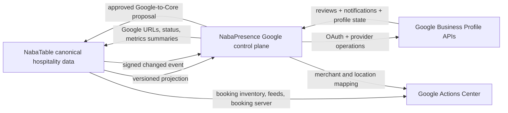

# Google Business Profile expansion — master implementation plan

Date: 2026-07-30

Status: ready for product and technical review

Scope: NabaPresence + NabaTable + Google Business Profile + Google Actions Center

## 1. Goal

Turn NabaPresence into the shared Google presence control plane for Lapen Inns
products while continuing to use NabaTable as the canonical hospitality system.

The completed programme will:

- preserve NabaPresence's existing Google review ingestion, reply workflow,
  Pub/Sub handling, tenant isolation, and provider-write recovery;
- use NabaTable as the source of truth for venue identity, booking URLs,
  operating and special hours, menus, restaurant attributes, service items, and
  media sources;
- add Google Business Profile performance metrics, search keywords, Posts,
  profile editing, booking links, FoodMenus, media, Q&A, and conditional lodging
  data;
- give NabaTable Google-derived review and Maps URLs, connection health, and
  presence summaries without giving NabaTable access to Google OAuth tokens;
- treat Reserve with Google as a separate Actions Center partnership and
  booking-platform workstream owned primarily by NabaTable;
- retire NabaTable's duplicate direct Google write path only after NabaPresence
  has reached feature parity and passed live pilot certification.

This is a plan of plans. Each capability receives a focused design and execution
plan before implementation. No capability is considered shipped from source
inspection or mocked tests alone.

## 2. Existing ground truth

### NabaPresence

NabaPresence already owns:

- Google OAuth with PKCE, offline access, encrypted refresh/access tokens, and
  the `business.manage` scope;
- Google account and location discovery and location linking;
- review backfill, incremental reconciliation, Pub/Sub ingestion, retry, replay,
  and provider-deletion handling;
- AI-assisted reply drafting, verification, approval, publication, deletion,
  moderation state, and three-phase provider mutation recovery;
- review and reply analytics;
- tenant-scoped PostgreSQL access, privacy retention, audit, jobs, leases,
  feature flags, and OpenTelemetry.

The approved performance design at
`docs/superpowers/specs/2026-07-30-gbp-performance-analytics-design.md` is
sub-project 1 and remains the authoritative specification for that capability.

### NabaTable

NabaTable already contains source implementations for:

- its own Google OAuth connection and encrypted token storage;
- account/location discovery;
- Google profile reads and writes;
- canonical restaurant profile, operating-hours, business-context, and menu
  models;
- bidirectional field comparison, drift state, snapshots, pinned baselines,
  preflight, publish jobs, retry, pause controls, audit logs, and rollback flags;
- FoodMenus import review and full-menu publishing;
- public booking pages at `/restaurants/{slug}/book`;
- stored Google Maps and Google review URLs used by guest communications.

NabaTable's GBP route map explicitly says the implementation is source-backed
and does not prove live Google or production operation. Its production wiring
checklist therefore remains an input to this programme's live certification,
not evidence that the duplicate connector is safe to remove.

## 3. Architectural decision

### 3.1 One Google control plane

NabaPresence becomes the only Lapen Inns service that:

- stores Google OAuth tokens;
- calls Google Business Profile management APIs;
- owns Google Pub/Sub notification settings and delivery;
- persists provider snapshots, provider mutation attempts, and provider audit
  results;
- schedules Google reconciliation and handles quota/retry behaviour.

NabaTable must not receive Google access or refresh tokens. NabaPresence must not
receive NabaTable database credentials or Supabase service-role keys.

NabaTable remains the only source that can authoritatively define:

- restaurant name and public description;
- public phone, website, structured address, timezone, and venue status;
- regular hours, special hours, and service periods;
- categories, service areas, attributes, and service items;
- public booking page URL and booking availability;
- canonical food/drink menus, prices, dietary/allergen metadata, and menu media;
- accommodation information if a future NabaTable lodging domain is approved.

### 3.2 Cross-product flow



### 3.3 Do not perform a big-bang migration

NabaTable's existing Google connector stays enabled initially in read-only or
shadow mode. Its write families are disabled one at a time only after the
corresponding NabaPresence capability passes:

1. contract parity;
2. local and staging integration tests;
3. shadow comparison against the same pilot location;
4. one approved live write;
5. rollback rehearsal;
6. an observation window with no unexplained drift.

Token migration is not the default. Operators reconnect through NabaPresence
unless Google and security review confirms a safe, consent-preserving migration
path. Duplicate OAuth grants may coexist during the compatibility window, but
only one system may have a given provider-write family enabled.

## 4. Source-of-truth matrix

| Domain | Authoritative system | NabaPresence responsibility | NabaTable responsibility |
| --- | --- | --- | --- |
| Google credentials | NabaPresence | Store, refresh, revoke, audit | Never store shared-control-plane tokens |
| Google account/location link | NabaPresence | Discover and bind Google resource names | Supply and retain restaurant identity |
| Restaurant profile | NabaTable | Compare, propose, publish approved changes | Author canonical values and revisions |
| Hours/special hours | NabaTable | Validate, compare, publish, reconcile | Author canonical schedules |
| Attributes/categories/services | NabaTable | Capability-check and publish | Author canonical business context |
| Booking URL | NabaTable | Manage GBP Place Action link | Produce stable HTTPS booking URL |
| FoodMenus | NabaTable | Project, preflight, publish, read back | Author canonical menu and media references |
| Location media | NabaTable for source assets; Google for live state | Upload/publish/reconcile | Supply approved assets and metadata |
| Reviews and replies | NabaPresence | Ingest, draft, approve, publish, analyse | Consume review URL and optional summaries |
| Google Posts | NabaPresence workflow | Compose, approve, schedule, publish | Optionally supply event/offer/menu context |
| Performance/keywords | NabaPresence | Ingest and retain Google aggregates | Consume safe summaries/deep links |
| Q&A | NabaPresence | Ingest, draft, approve, publish answers | Optionally supply factual venue context |
| Lodging | Undecided until product discovery | Publish/reconcile if applicable | Author only after a lodging domain exists |
| Reserve with Google | NabaTable + Actions Center | Supply merchant/location mapping and health | Own inventory feeds, booking server, RTUs |

## 5. Shared cross-product foundation

This foundation is a release dependency for every capability that consumes
NabaTable data. Performance analytics may be implemented in parallel because it
only needs the existing Google location link.

### FND-001 — Product identity and venue mapping

Add a tenant-scoped mapping in NabaPresence:

`nabatable_venue_link`

- `id uuid primary key`
- `organisation_id uuid not null`
- `location_id uuid not null`
- `external_location_id uuid not null`
- `nabatable_restaurant_id uuid not null`
- `nabatable_restaurant_slug text`
- `nabatable_revision bigint not null`
- `status text` in `pending | active | mismatched | disabled`
- `last_projection_at`, `last_event_at`, `last_error_code`
- created/updated timestamps
- unique active bindings for both the NabaPresence location and NabaTable
  restaurant
- forced tenant RLS and runtime-role grants

Linking requires owner/admin authority and explicit confirmation of:

- NabaPresence organisation/location;
- Google account/location;
- NabaTable restaurant;
- Google title/address vs NabaTable name/address comparison.

Mismatched identity does not auto-link and does not publish.

### FND-002 — Service authentication

Use asymmetric, audience-bound service JWTs rather than a shared database or
browser session:

- NabaPresence audience: `nabapresence-internal`
- NabaTable audience: `nabatable-internal`
- short lifetime, unique `jti`, issuer allowlist, key id, rotation overlap;
- method, path, body hash, and idempotency key bound into mutation claims;
- replay ledger for mutation requests;
- separate staging and production keys;
- no `NEXT_PUBLIC_*` secrets;
- redacted structured audit in both systems.

Route handlers are public network endpoints even when called service-to-service,
so every internal handler independently authenticates, authorizes, validates,
rate-limits, and returns a minimal DTO.

### FND-003 — NabaTable presence projection v1

Create a server-only NabaTable data-access module and an authenticated internal
endpoint:

`GET /api/internal/presence/v1/restaurants/{restaurantId}/projection`

Response:

```text
VenuePresenceProjectionV1
  restaurantId
  revision
  generatedAt
  profile
    name, description, phone, website, structuredAddress, timezone
    categories, serviceAreas, attributes, serviceItems
  hours
    regular, special, moreHours, servicePeriods
  links
    bookingUrl, mapsUrl, reviewUrl
  menu
    canonical menu projection + content hash
  media
    logo and approved venue/menu asset references + content hashes
  lodging
    null until the lodging domain is approved
```

Rules:

- build from NabaTable domain services, never direct ad hoc route queries;
- return only publishable public-business data;
- validate with a shared JSON Schema fixture in both repositories;
- include a monotonically increasing restaurant projection revision;
- emit stable field keys matching the NabaTable dual-sync registry;
- use content hashes for large menu/media sections;
- support `If-None-Match`/ETag for reconciliation efficiency;
- never include guest, booking, staff, payment, or provider credential data.

### FND-004 — Change events and reconciliation

NabaTable emits a signed, content-minimal event after a committed canonical
change:

```text
VenuePresenceChangedV1
  eventId
  restaurantId
  revision
  changedSections[]
  occurredAt
```

NabaPresence:

- verifies and deduplicates the event;
- resolves `nabatable_venue_link`;
- queues a projection pull;
- computes drift and creates candidates;
- never publishes directly from the webhook request;
- periodically reconciles active links so a missed event cannot cause permanent
  drift.

Delivery is at-least-once. Events are hints; the versioned projection is the
source of truth.

### FND-005 — Google-to-NabaTable proposal contract

Google updates must not silently overwrite NabaTable canonical data.

Create:

`POST /api/internal/presence/v1/restaurants/{restaurantId}/import-proposals`

The request contains:

- proposal/idempotency id;
- NabaTable baseline revision;
- Google snapshot hash;
- selected stable field decisions;
- normalized proposed values;
- actor and NabaPresence audit reference.

NabaTable applies proposals through its existing domain/core-write services and
returns the new revision. A stale baseline returns `409`; NabaPresence refreshes
and asks for a new decision. High-risk fields remain manual.

### FND-006 — Google-derived data back to NabaTable

Create a minimal NabaPresence internal read endpoint:

`GET /api/internal/nabatable/v1/venues/{restaurantId}/google-summary`

It returns:

- connection and location-link health;
- Maps URI and `newReviewUri`;
- latest review/reply summary counts;
- current profile drift count by section;
- performance `freshThrough` and selected aggregate totals;
- deep links into NabaPresence, not raw provider identifiers.

NabaTable uses `newReviewUri` for post-booking email/WhatsApp review requests,
replacing manually maintained Google review links after parity. The old
`restaurants.google_review_url` remains a compatibility cache during migration.

### FND-007 — Shared operational controls

Add independent rollback flags:

- `NABATABLE_INTEGRATION_ENABLED`
- `NABATABLE_EVENTS_ENABLED`
- `GBP_PERFORMANCE_ENABLED`
- `GBP_POSTS_ENABLED`
- `GBP_PROFILE_WRITES_ENABLED`
- `GBP_PLACE_ACTIONS_ENABLED`
- `GBP_FOOD_MENUS_ENABLED`
- `GBP_MEDIA_ENABLED`
- `GBP_KEYWORDS_ENABLED`
- `GBP_QA_ENABLED`
- `GBP_LODGING_ENABLED`
- `ACTIONS_CENTER_ENABLED`

All provider writes also obey one global emergency stop. Reads, audit, and
reconciliation remain available while writes are paused.

## 6. Capability workstreams

### Workstream A — Performance analytics

Authoritative spec:
`docs/superpowers/specs/2026-07-30-gbp-performance-analytics-design.md`.

Execute that spec first, with these programme-level additions:

- associate every metric series with the optional NabaTable restaurant mapping;
- expose a safe summary through FND-006;
- show NabaTable booking conversions when Google returns
  `BUSINESS_BOOKINGS`;
- do not hardcode the legacy 18-month horizon until the current Performance API
  accepts it in a live contract test;
- keep raw Google dates as location-local calendar dates;
- never synthesize recent lagging days as zero.

Exit criteria:

- backfill and recurring ingestion work for a verified pilot;
- organisation and per-location views match Google for the same range;
- NabaTable can read the safe summary without receiving Google credentials;
- feature-off, ineligible location, provider lag, and disconnect states pass.

### Workstream B — Google Posts

Create a dedicated Posts spec and execution plan.

Scope:

- list/get existing posts;
- create, edit, and delete standard updates, events, and offers;
- scheduled and recurring posts when the live project supports them;
- CTA links restricted to allowlisted HTTPS destinations;
- media-by-source URL with validation and provider read-back;
- draft, verification, human approval, scheduled publication, and audit;
- local-post state and rejection/error display;
- optional NabaTable event/offer context imported as a draft only.

Architecture:

- reuse the reply three-phase mutation pattern;
- persist `post`, `post_revision`, `post_publish_attempt`, and provider snapshot
  state under tenant RLS;
- record intent before the provider call, call Google outside DB transactions,
  and settle/read back afterward;
- use per-location edit budgets and the global emergency stop;
- never auto-publish text generated from untrusted review/Q&A content.

Exit criteria:

- each post type passes contract fixtures and a live pilot;
- retries cannot duplicate a post;
- scheduled jobs are fleet-safe and observable;
- delete/edit ambiguity is resolved by provider read-back;
- NabaTable-supplied context cannot bypass NabaPresence approval.

### Workstream C — Profile information and drift

Use NabaTable's existing stable field registry, canonicalizers, pinned hashes,
preflight, pause control, and operation grouping as the design reference. Port
the concepts and relevant pure domain logic; do not port NabaTable credential
storage, Supabase repository, route authentication, or tenant assumptions.

Initial fields:

- name;
- description;
- primary phone and website;
- structured address;
- primary/additional categories;
- regular, special, and more hours;
- service areas;
- attributes;
- service items;
- open status only after a separate high-risk review.

Workflow:

1. pull NabaTable projection and Google location/attributes;
2. normalize both into stable field rows;
3. classify `in_sync`, `core_dirty`, `google_dirty`, `conflict`,
   `unsupported`, or `blocked`;
4. let an authorized human choose import/export/ignore;
5. pin NabaTable revision and Google snapshot hash;
6. run Google `validateOnly` where supported;
7. persist mutation intent;
8. execute outside the transaction;
9. read back Google and recompute drift;
10. optionally submit approved imports through FND-005.

High-risk rules:

- no automatic name, address, category, or open-status changes;
- field-specific capability checks and masks;
- Google-owned metadata is import-only;
- preserve structured address metadata;
- export only fields owned by NabaTable;
- never let NabaPresence become a second independent venue editor.

Exit criteria:

- shadow comparisons match NabaTable's existing dual-sync results;
- one approved pilot export and one import proposal succeed;
- stale pins prevent overwriting newer changes;
- rollback flags and pause controls are rehearsed;
- NabaTable direct writes for migrated fields are disabled only after the
  observation window.

### Workstream D — NabaTable booking Place Action

Use the Google Place Actions API to manage the NabaTable public reservation
link.

Source URL:

`https://{NABATABLE_ROOT_DOMAIN}/restaurants/{slug}/book`

Requirements:

- generated server-side from an allowlisted NabaTable origin and canonical slug;
- HTTPS only, no arbitrary operator-provided destination;
- restaurant profile readiness and public booking availability must pass;
- list supported action types for the location/country before creating;
- reconcile existing links before create/update to prevent duplicates;
- mark the NabaTable link primary only when policy permits;
- pause or remove the link when the venue disables public bookings;
- record link id, URI hash, provider state, and mutation attempts;
- publish booking-click and Google `BUSINESS_BOOKINGS` metrics where available.

Exit criteria:

- link appears on the pilot listing and reaches the correct venue booking page;
- venue disable/slug change reconciles safely;
- malicious or cross-tenant URLs are rejected;
- duplicate links are not created after retries.

### Workstream E — FoodMenus

Use NabaTable's `CanonicalRestaurantMenu` and its existing Google FoodMenus
projection/import-review logic as the canonical domain reference.

Scope:

- eligibility from Google location metadata;
- read and snapshot existing FoodMenus;
- project NabaTable menus, sections, items, options, prices, labels, cuisines,
  allergens, dietary restrictions, ingredients, preparation, portions,
  nutrition, and approved media keys;
- compare by stable NabaTable menu/item keys;
- import suggestions into NabaTable through FND-005;
- full-resource export with baseline hash and provider preflight/read-back;
- explicit handling of Google's item/photo limits;
- menu source URL pointing to the stable NabaTable menu or venue page.

Rules:

- NabaTable remains canonical;
- full-menu replacement requires approval and an exact preview;
- a missing/unsupported Google value is not interpreted as delete;
- local images are published through Workstream F before their Google media keys
  are referenced;
- menu import never executes untrusted source code.

Exit criteria:

- deterministic projection fixtures match NabaTable;
- live pilot read, preview, export, and read-back pass;
- partial failure cannot leave a false `in_sync` state;
- NabaTable's old FoodMenus publisher is disabled after parity.

### Workstream F — Location and menu media

Scope:

- list owner and customer media separately;
- publish location logo/cover/exterior/interior/food/menu media;
- upload using supported Google flows or source URLs;
- retain stable NabaTable asset identity and Google media resource identity;
- update allowed metadata and delete owned media;
- show moderation/provider state and non-static URL caveats;
- ingest review media through the existing review pipeline without mixing it
  with owner media.

NabaTable supplies approved asset references and content hashes. NabaPresence
downloads only from allowlisted origins, validates type/size/dimensions, scans
content where required, and prevents SSRF. Provider-hosted URLs are treated as
expiring references rather than permanent asset storage.

Exit criteria:

- logo/cover/food pilot images render on Google;
- unsafe source URLs and oversized/invalid files fail before provider calls;
- retry does not duplicate media;
- delete/edit ambiguity is reconciled.

### Workstream G — Search keyword analytics

Add after daily performance metrics are stable.

Scope:

- monthly search-keyword impression ingestion with pagination;
- normalized keyword, threshold-vs-value semantics, month, and location;
- rolling retention appropriate for aggregate non-personal metrics;
- organisation and per-location keyword tables;
- comparison periods and CSV export with formula-injection protection;
- safe summary/deep link for NabaTable.

Privacy rule: do not join search keywords to individual reviewers, guests,
bookings, or customer identities.

Exit criteria:

- pagination, thresholds, low-volume/empty data, and restatements pass;
- totals and sample keywords match the pilot GBP dashboard/API;
- export and tenant isolation pass.

### Workstream H — Q&A

Scope:

- list questions and answers;
- notification-triggered refresh where Google supports it, plus reconciliation;
- draft answers using NabaTable public venue facts as grounded context;
- deterministic and semantic verification;
- human approval before upsert/delete;
- distinguish owner answer from community answers;
- preserve provider attribution and timestamps within the retention policy.

Q&A remains lower priority than Posts/profile/menu because it introduces another
untrusted-content workflow. It must reuse the review prompt-injection boundary
and must never allow a question to instruct the model or provider workflow.

Exit criteria:

- list/upsert/delete pass fixtures and live pilot;
- generated answers cite only current NabaTable projection facts;
- stale venue facts or changed questions block publication;
- poison events cannot hot-loop.

### Workstream I — Lodging

Start with a product discovery gate:

- identify which Lapen Inns venues are eligible lodging businesses;
- confirm the NabaTable domain contains authoritative lodging facts;
- identify legal/ops owners for amenities, policies, check-in/out, and
  sustainability data;
- run read-only Lodging API discovery on an eligible pilot.

If no canonical domain and owner exist, keep `GBP_LODGING_ENABLED=false` and do
not create a NabaPresence-only lodging editor.

If approved:

- add a versioned NabaTable lodging projection;
- implement read/compare/validate/update/read-back in NabaPresence;
- make high-risk fields manual;
- import Google updates through FND-005.

### Workstream J — Reserve with Google / Actions Center

This is not an ordinary GBP API feature and does not use the normal
`business.manage` integration as its booking transport.

NabaTable owns:

- Actions Center partner application and commercial/operational relationship;
- merchant, service, and availability feeds;
- booking server API;
- booking create/update/cancel lifecycle;
- real-time inventory updates;
- availability checker performance;
- 24-hour production feed delivery;
- latency, error-rate, and booking reconciliation operations.

NabaPresence supplies:

- Google Business Profile account/location/place mapping;
- connection/verification health;
- merchant matching evidence;
- Place Action conflict visibility;
- `BUSINESS_BOOKINGS` presence metrics;
- cross-product deep links and audit references.

Stages:

1. partner-interest submission and eligibility confirmation;
2. sandbox account and integration-mode decision;
3. merchant/service/availability feed schemas;
4. sandbox booking server and real-time updates;
5. end-to-end booking/cancel/reconcile tests;
6. sandbox review;
7. production feed and booking server;
8. limited pilot merchants;
9. monitored launch and support rota.

Actions Center blockers remain `BLOCKED`, not approximated, until Google grants
partner access.

## 7. Sequencing and dependencies

| Wave | Work | Dependency | Can run in parallel |
| --- | --- | --- | --- |
| 0 | Google access, pilot listings, API inventory, Actions Center application | none | yes, external |
| 1 | FND-001–007 cross-product foundation | none | performance design/implementation |
| 2 | Performance analytics | existing Google location links | FND foundation |
| 3 | Posts | stable provider mutation framework | profile design |
| 4 | Profile/drift | FND projection/proposals | Place Actions |
| 5 | NabaTable booking Place Action | FND projection + public booking readiness | profile |
| 6 | FoodMenus and media | FND + media security + profile location link | each other with ordered publish |
| 7 | Search keywords and Q&A | performance / untrusted-content framework | each other |
| 8 | Lodging, if approved | lodging product gate | Actions Center |
| 9 | Reserve with Google production | Google partner approval + NabaTable booking maturity | later GBP waves |
| 10 | Retire NabaTable duplicate Google writes | parity and live observation for every migrated family | none |

Release slices should remain independently useful. Do not hold performance
analytics until Actions Center or lodging is available.

## 8. Plan-of-plans deliverables

Create and approve these documents before their implementation begins:

1. `gbp-cross-product-integration-design.md`
2. `gbp-cross-product-foundation-plan.md`
3. existing `gbp-performance-analytics-design.md`
4. `gbp-performance-analytics-plan.md`
5. `gbp-posts-design.md` and `gbp-posts-plan.md`
6. `gbp-profile-dual-sync-design.md` and `gbp-profile-dual-sync-plan.md`
7. `gbp-place-actions-design.md` and `gbp-place-actions-plan.md`
8. `gbp-food-menus-media-design.md` and execution plan
9. `gbp-search-keywords-design.md` and execution plan
10. `gbp-qa-design.md` and execution plan
11. conditional `gbp-lodging-design.md`
12. `actions-center-reservations-design.md` and onboarding runbook
13. `nabatable-gbp-decommission-plan.md`

Every execution plan must name exact files in both repositories, include
red-green-refactor steps, and end with live/staging evidence requirements.

## 9. Shared database and workflow rules

- Every new NabaPresence row includes `organisation_id` and forced RLS.
- Every NabaTable mutation remains scoped by `restaurant_id`.
- Provider calls never occur inside long database transactions.
- Every external mutation uses:
  `persist intent -> provider call -> settle -> provider read-back`.
- Idempotency keys include operation, tenant, location/resource, generation,
  and content hash.
- Provider snapshot hashes and NabaTable revisions are pinned before writes.
- No remote delete is inferred from an absent optional field.
- Google-owned output metadata is never exported back to Google.
- Raw content follows NabaPresence retention policy; aggregate metrics receive a
  documented classification.
- Cross-product events contain identifiers and revisions, not full customer or
  venue payloads.
- Audit metadata excludes tokens, guest PII, raw question/review text, and
  provider authorization headers.

## 10. Test strategy

### Contract fixtures

- shared JSON Schema fixtures for projection, event, proposal, and summary
  contracts in both repositories;
- official Google request/response fixtures per API;
- recorded live pilot fixtures redacted and frozen after certification;
- consumer-driven tests proving both products can upgrade independently.

### NabaPresence

- unit tests for canonicalization, masks, hashes, planners, and date math;
- Google request-contract tests;
- PostgreSQL integration tests under the non-superuser runtime role;
- tenant, role, IDOR, replay, stale-revision, and feature-off tests;
- job/retry/ambiguity/reconciliation tests;
- Playwright desktop/mobile/accessibility scenarios.

### NabaTable

- projection DTO and revision tests;
- service-auth and cross-restaurant authorization tests;
- event outbox/delivery/idempotency tests;
- import-proposal stale-baseline and domain-validation tests;
- booking URL readiness and canonical-origin tests;
- menu/media projection compatibility tests;
- existing `pnpm verify` and workspace gates.

### Cross-product staging

- link one NabaPresence location to one NabaTable restaurant;
- change one field in NabaTable and observe a NabaPresence drift candidate;
- approve an export and verify Google then both local read models;
- make a Google-side change and apply an approved proposal to NabaTable;
- rotate service keys;
- drop/delay/duplicate events and prove reconciliation;
- pause each write family independently;
- disconnect/reconnect Google without losing the NabaTable venue mapping;
- verify no endpoint exposes Google tokens or cross-tenant data.

## 11. Google and release gates

Before any general-availability claim:

- Google Cloud project has approved GBP API access;
- required APIs are enabled for each workstream;
- OAuth consent and redirect URIs are approved;
- at least one dedicated verified pilot profile exists;
- Pub/Sub topic and OIDC push identity are configured;
- current quotas and the fixed per-profile edit limit are documented;
- no-sandbox limitations are reflected in the runbook;
- every provider write family has `validateOnly` or a read-only preview where
  the API supports it;
- pilot owners approve the exact fields/actions used in live tests;
- data retention and Google API policy review are signed off;
- incident contacts and emergency flags are rehearsed;
- NabaTable duplicate write flags are documented and off for migrated families.

## 12. Observability and operations

Add product and provider dimensions without leaking tenant or content data:

- projection pull/event lag and revision mismatch;
- Google request duration, status family, retry class, and quota deferral;
- drift count by section and age;
- publish attempt state and ambiguity age;
- performance/keyword freshness;
- post schedule lag;
- Place Action health and destination mismatch;
- menu/media projection and read-back mismatch;
- Q&A unanswered and failed-publication age;
- Actions Center feed age, booking server latency/error rate, and RTU lag.

Operations surfaces must answer:

- Is Google connected?
- Is NabaTable linked and current?
- Which system owns this field?
- What is drifted?
- What is paused?
- What write is pending or ambiguous?
- What was the last confirmed provider state?

## 13. Decommissioning NabaTable's duplicate GBP connector

Decommission per write family, not per application.

For each family:

- freeze NabaTable feature expansion;
- export current connection/location/snapshot identifiers for reconciliation;
- run NabaPresence in shadow compare;
- prove parity and migrate operator links;
- disable NabaTable writes with its existing rollback flag;
- retain read-only history for the agreed audit period;
- remove scheduled jobs and provider permissions;
- revoke obsolete OAuth grants/tokens;
- remove secrets only after rollback window closes;
- update NabaTable UI to deep-link to NabaPresence or consume its safe summary;
- delete dead provider code only in a later cleanup release.

Do not remove NabaTable's canonical profile/menu domain or dual-sync pure-domain
logic that is still used for projection and import proposals.

## 14. Immediate next planning tasks

- [ ] Confirm the single-control-plane decision with the product owner and the
      operator who manages the Google profiles.
- [ ] Inventory current Google Cloud projects, OAuth clients, approved APIs,
      quotas, Pub/Sub topics, and live grants used by both products.
- [ ] Select staging and production NabaTable/NabaPresence base URLs and service
      identity owners.
- [ ] Write and approve `gbp-cross-product-integration-design.md`, including the
      exact projection/event/proposal schemas.
- [ ] Break the approved performance design into its executable implementation
      plan.
- [ ] Submit or confirm the Google Actions Center partner-interest application.
- [ ] Identify one restaurant-only pilot and, if lodging proceeds, one eligible
      accommodation pilot.
- [ ] Record which NabaTable GBP write flags are currently enabled in each
      environment without recording secret values.
- [ ] Create a shared live-certification evidence index covering both products.

The first implementation work should be the cross-product contract foundation
and performance analytics. Provider-write expansion starts only after the
foundation contract is stable.
